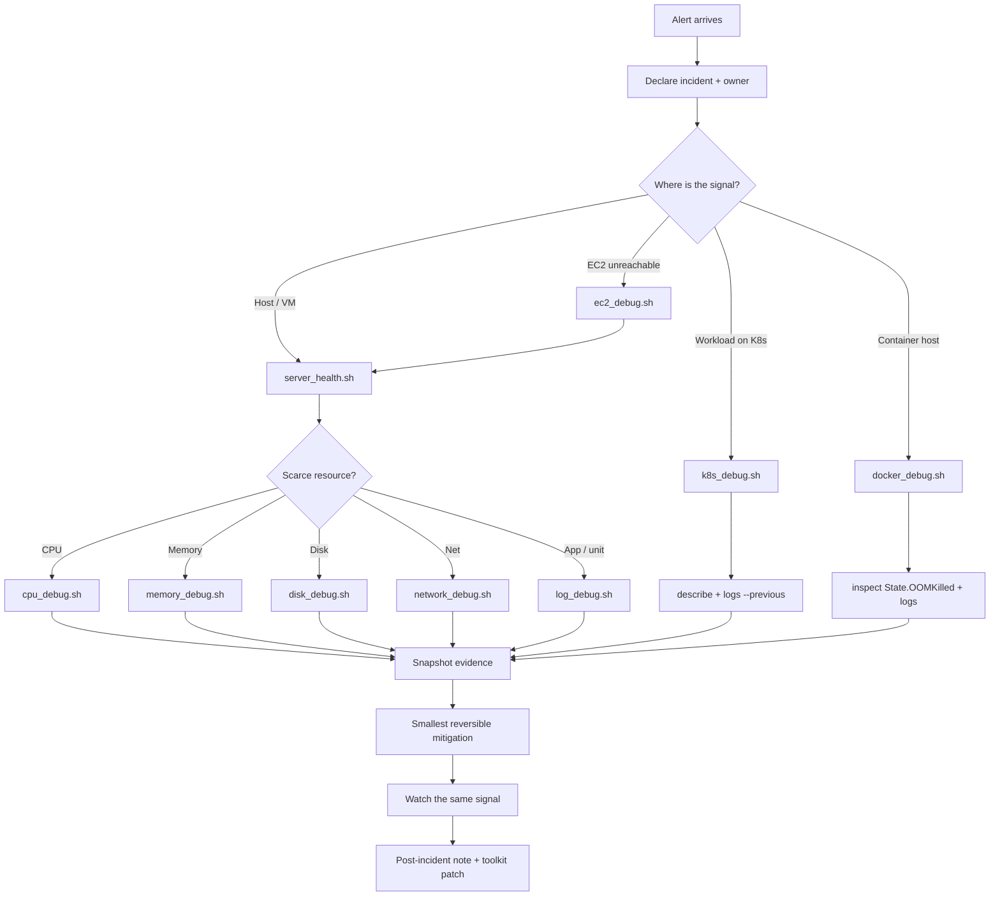

# Incident flow

```mermaid
flowchart TD
  A[Alert arrives] --> B[Declare incident + owner]
  B --> C{Where is the signal?}
  C -->|Host / VM| D[server_health.sh]
  C -->|EC2 unreachable| E[ec2_debug.sh]
  C -->|Workload on K8s| F[k8s_debug.sh]
  C -->|Container host| G[docker_debug.sh]
  D --> H{Scarce resource?}
  H -->|CPU| I[cpu_debug.sh]
  H -->|Memory| J[memory_debug.sh]
  H -->|Disk| K[disk_debug.sh]
  H -->|Net| L[network_debug.sh]
  H -->|App / unit| M[log_debug.sh]
  E --> D
  F --> N[describe + logs --previous]
  G --> O[inspect State.OOMKilled + logs]
  I --> P[Snapshot evidence]
  J --> P
  K --> P
  L --> P
  M --> P
  N --> P
  O --> P
  P --> Q[Smallest reversible mitigation]
  Q --> R[Watch the same signal]
  R --> S[Post-incident note + toolkit patch]
```
